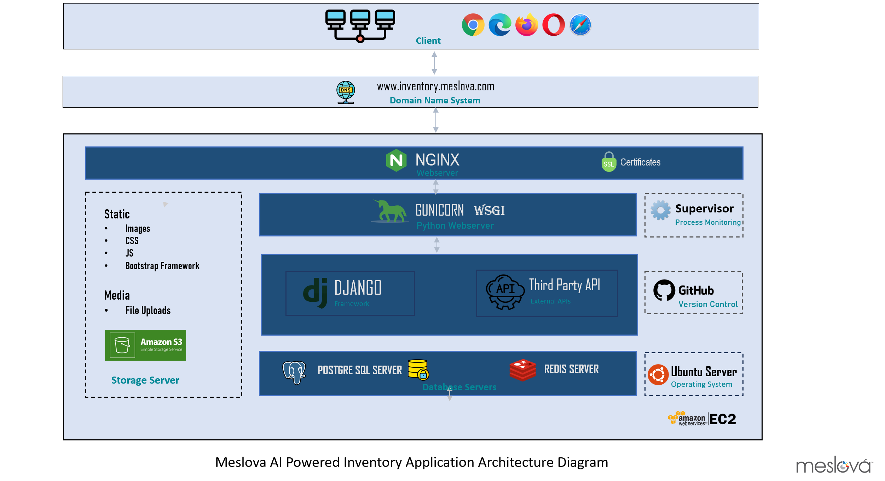
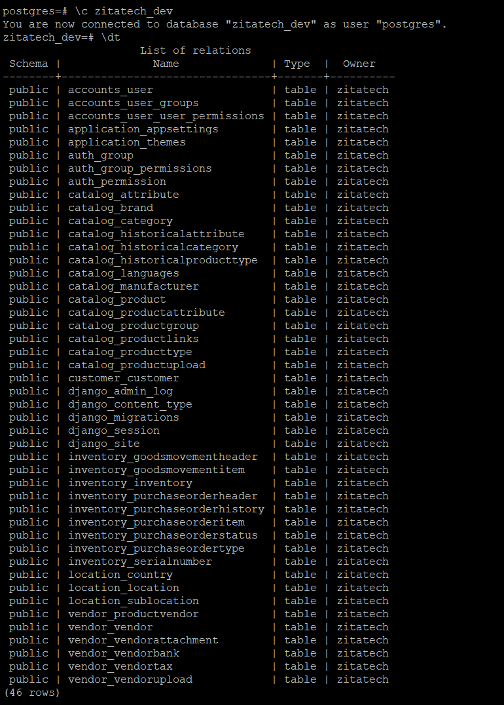
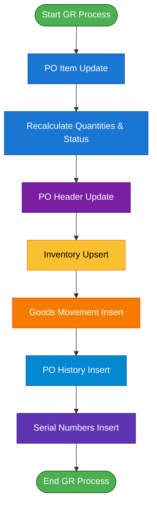
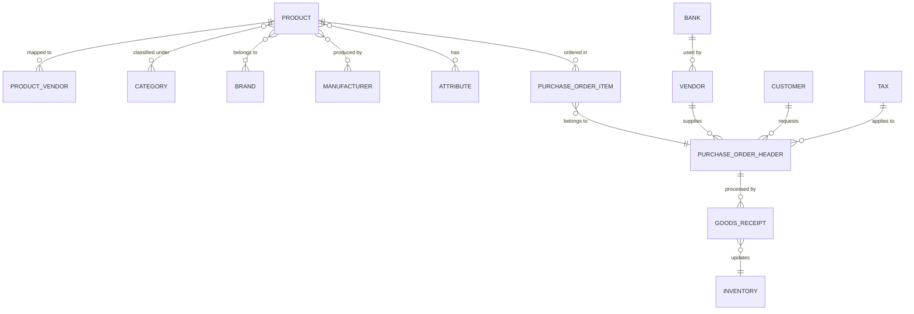
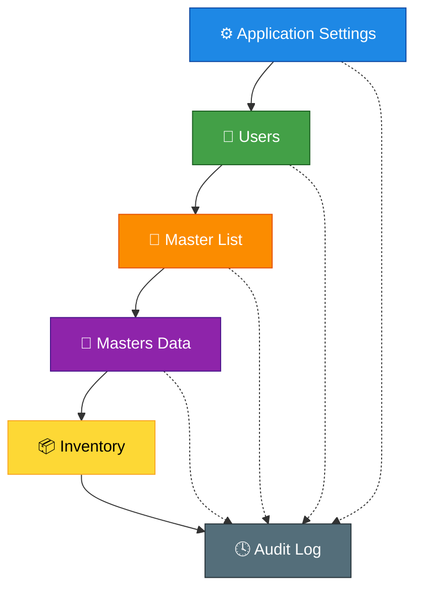

# 📦 Meslova Inventory Management System

The **Meslova Inventory App** is designed to manage products, vendors, and associated business information in a **structured and scalable way**.  
It provides centralized management of master data, vendor details, users, and application settings.  

The app supports **Role-Based Access Control (RBAC)** to ensure secure data handling and proper authorization.

---

## 🚀 Features

- **Centralized Data Management** – Products, vendors, users, and settings in one place.  
- **Role-Based Access Control (RBAC)** – Admin, Staff, and Guest access levels.  
- **Record-wise Tracking** – Each record maintains `Created By`, `Created Date`, `Updated By`, and `Updated Date`.  
- **No Hard Delete** – Records are marked as *Inactive* instead of permanent deletion.  
- **Status Lifecycle** – Draft, Active, and Inactive states for records.  
- **Search & Filters** – Simple keyword search or advanced filtering by category, vendor, country, status, etc.  

---

# 🗂️ Project Modules

This repository contains the core modules for managing **Masters Data, Master Lists, Inventory, Users, and Application Settings**.  
Each module is designed to keep the system structured, scalable, and easy to maintain.

---

## 📌 1. Masters Data
Manages all product-related reference data.  
- **Category** – Organize items into logical categories.  
- **Product Type** – Define the type/class of products.  
- **Product Group** – Group products under shared attributes.  
- **Brand** – Maintain brand details.  
- **Manufacturer** – Store manufacturer information.  
- **Languages** – Multilingual support.  
- **Country** – Country-specific details.  
- **Attributes** – Product characteristics & metadata.  
- **Product** – Core product records.  
- **Product Links** – Relations between products.  
- **Product Vendors** – Vendor-specific product mapping.  
- **Purchase Order Type** – Define order types.  
- **Purchase Order Status** – Track order progress.

---

## 📌 2. Master List
Centrally manages key business entities.  
- **Vendor** – Vendor directory.  
- **Bank** – Banking details.  
- **Tax** – Taxation setup.  
- **Attachments** – Document management.  
- **Products** – Product master reference.
- **Customer** – Customer master reference.  

---

## 📌 3. Inventory
Tracks stock movement and availability.  
- **Goods Receipt** – Record incoming stock.  
- **Inventory Enquiry** – Check inventory status.

---

## 📌 4. Users
Handles authentication and account settings.  
- **Login** – Secure user login.  
- **My Account** – Manage personal profile.  
- **Change Password** – Update account credentials.  

---

## 📌 5. Application Settings
System-wide settings and configurations.  
- **Logo & App Config** – Branding & general settings.  
- **Themes** – UI personalization.  
- **User Management** – Manage users & roles.

## 🕓 6. Audit Log

**Purpose:**  
Tracks all activities and changes for compliance and transparency.
Records changes in:
- Master List  
- Masters Data  
- Inventory  

---

## 👥 Roles & Permissions

- **Admin** – Full access, system configuration, master data setup, and maintenance.  
- **Staff** – Can create operational data (no edit and deletion rights).  
- **Guest** – View-only access for transparency without modifications.  

---

## 📑 Data Insertion Templates

- Product  
- vendor

---

## 🔄 Record Status Lifecycle

- **Draft** – Default state when a record is created.  
- **Active** – Finalized and approved records.  
- **Inactive** – Archived/discontinued records (read-only).  

---
## ⚙️ System Architecture

The following diagram illustrates the **Meslova AI Powered Inventory Application Architecture**:

### 🔹 Client Layer
- Web browsers: **Chrome, Edge, Firefox, Opera, Safari**
- Access via domain: `www.inventory.meslova.com`

### 🔹 Network Layer
- **DNS (Domain Name System)** – Resolves domain to server IP.  
- **SSL Certificates** – Secure communication over HTTPS.  

### 🔹 Web Server Layer
- **NGINX** – Handles client requests, serves static files, load balancing, reverse proxy.  
- **Gunicorn (WSGI Python Webserver)** – Application server connecting Django to NGINX.  

### 🔹 Application Layer
- **Django Framework** – Core backend.  
- **Third-Party APIs** – Integrations with external services.  
- **Supervisor** – Process monitoring and management.  
- **GitHub** – Version control and CI/CD.  

### 🔹 Static & Media Storage
- **Static Files** – Images, CSS, JS, Bootstrap framework.  
- **Media Files** – File uploads.  
- **Amazon S3** – Storage for static & media.  

### 🔹 Database Layer
- **PostgreSQL** – Relational database.  
- **Redis** – In-memory caching and session storage.  

### 🔹 Infrastructure Layer
- **Ubuntu Server** – Host operating system.  
- **AWS EC2** – Cloud hosting infrastructure.  

---

## ⚙️ Database Structure and Tables

The following diagram illustrates the **Meslova AI Powered Inventory Application Database Tables**.  
The database consists of multiple tables with relationships to support inventory management:

## 📦 Purchase Order Goods Receipt – End-to-End Flow

This document explains the **functional flow**, **process steps**, and **data elements** involved in updating Purchase Order (PO) quantities during Goods Receipt (GR).

---

### 🔹 Core Entities

- **PO Header** → Overall purchase order summary  
- **PO Item** → Line-level details (material, qty, price)  
- **Inventory** → Stock at Location + Sub-Location  
- **Goods Movement (GM)** → Transactional record for receipts  
- **PO History** → Log of changes in PO Items  
- **Serial Numbers** → Tracking of serialized products  

---

### 🔹 Key Data Items

| Field                | Description                                |
|-----------------------|--------------------------------------------|
| **POQTY**             | Ordered quantity                          |
| **POUOM**             | Unit of Measure                           |
| **AlreadyRecvdQty**   | Quantity received till date               |
| **QtyBeingReceived**  | Current quantity being received           |
| **YetToBeReceived**   | POQTY – AlreadyRecvdQty                   |
| **Location**          | Warehouse / Plant                         |
| **Sub-Location**      | Bin / Rack / Storage area                 |
| **ERDAT**             | Creation Date                             |
| **ERZET**             | Creation Time                             |
| **ERNAM**             | Created By                                |
| **AEDAT**             | Last Change Date                          |
| **AEZET**             | Last Change Time                          |
| **AENAM**             | Changed By                                |

---

### 🔹 Step-by-Step Process

### 1. PO Item Update
- Increase `AlreadyRecvdQty` by `QtyBeingReceived`
- Recalculate `YetToBeReceived`
- Update **Item Status**:
  - `OPEN` → Nothing received  
  - `PARTIALLY RECEIVED` → Partial receipt  
  - `CLOSED` → Fully received  
- Maintain audit fields (AEDAT, AEZET, AENAM)

---

### 2. PO Header Update
- Evaluate all PO Items:
  - If all closed → Header = `CLOSED`
  - If some received → Header = `PARTIALLY RECEIVED`
  - If none received → Header = `OPEN`
- Update audit fields

---

### 3. Inventory Upsert
- Locate existing record (Material + Location + Sub-Location)
  - If exists → Increase stock  
  - If not → Insert new stock record  
- Maintain audit fields

---

### 4. Goods Movement
- **GM Header** → Create with PO reference & audit info  
- **GM Item** → Create one entry per PO Item received  
  - Qty, UOM, Location, Sub-Location  

---

### 5. PO History
- Append record for each change in PO Item quantity:
  - Old Qty, New Qty, Change Qty  
  - Location, Sub-Location  
  - Audit fields  

---

### 6. Serial Numbers
- For serialized materials:
  - Insert one record per received unit  
  - Assign Location + Sub-Location  
  - Maintain audit fields  

---

# 📦 System Process & Data Relationship Diagrams

This document contains three main diagrams:

1. **🔄 Purchase Order Process Flow Diagram** – illustrates the operational workflow of the Goods Receipt (GR) process.  
2. **🧩 Data Relationship Flow Diagram** – shows how master and transactional entities are connected.  
3. **⚙️ System Flow Diagram** – depicts overall system architecture and module interactions.

---

## 🔄 1. Purchase Order Process Flow Diagram

This flow illustrates the sequence of operations during the **Goods Receipt (GR) process**, showing how Purchase Orders, Inventory, and History records are updated.

---

## 🧩 2. Data Relationship Flow Diagram

This ER-style diagram shows relationships between **Product**, **Vendor**, **Customer**, **Purchase Orders**, and **Inventory**.

---

## ⚙️ 3. System Flow Diagram

This diagram illustrates how the major application modules interact, with **data flowing from configuration to transaction tracking** and finally to **audit logging**.

---

## 🧠 Summary

| Diagram | Description |
|----------|--------------|
| **Purchase Order Process Flow** | Visualizes GR operations and updates across modules. |
| **Data Relationship Diagram** | Shows how master and transactional entities connect. |
| **System Flow Diagram** | Describes the high-level interaction between system modules. |

---

##Vendor and Product Bulk Upload Process:

{{hostname}}}/vendor/vendor_upload/list

We have a Bulk Uploads option available in the sidebar. This feature allows you to upload multiple vendors and products simultaneously using a sample file.

Here is the process:
1. Download the provided sample file.
2. Fill in your data within that file and save it.
3. Upload the completed file using the Bulk Uploads function. 

After the upload completes, the system will display a summary showing how many records succeeded and how many failed. 

If you need to understand the reason for any failed records, you can simply download the result file and review the details.

## 🚀 Getting Started

**1. Clone the repository**
- git clone https://github.com/your-org/meslova-inventory.git
- cd meslova-inventory

**2. Install dependencies**
pip install -r requirements.txt**

**3. Run database migrations**
python manage.py migrate

**4. Start development server**
python manage.py runserver

## ⚖️ License

Copyright (c) 2025 Zitatech
### © 2025 — Zitatech Inc - www.zitatechinc.com

